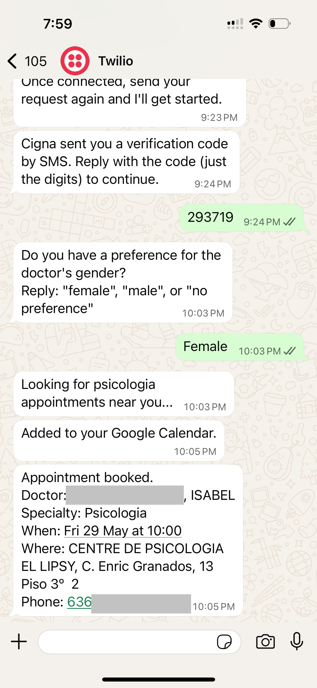
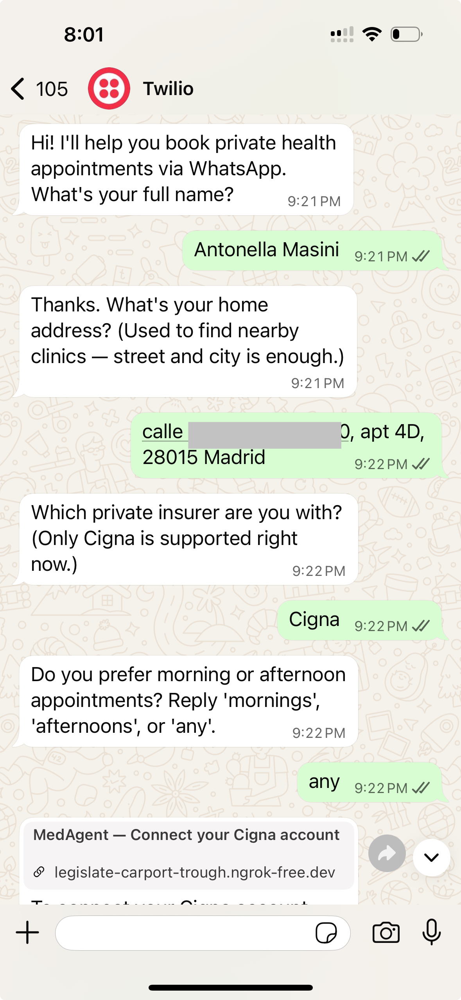
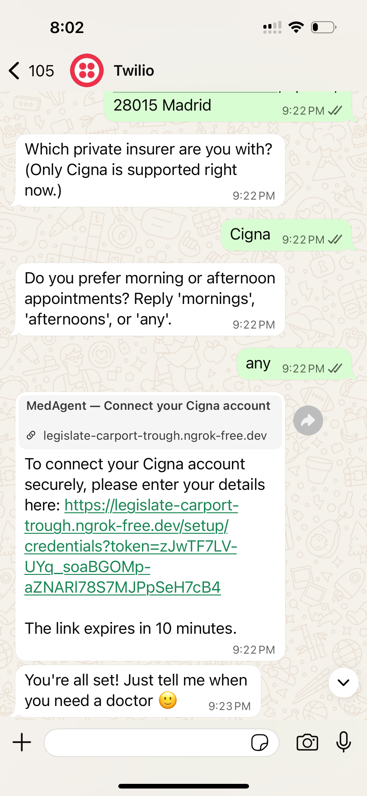
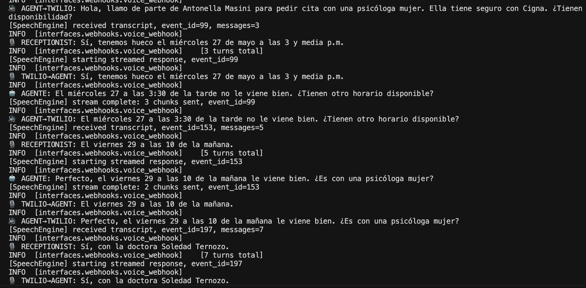
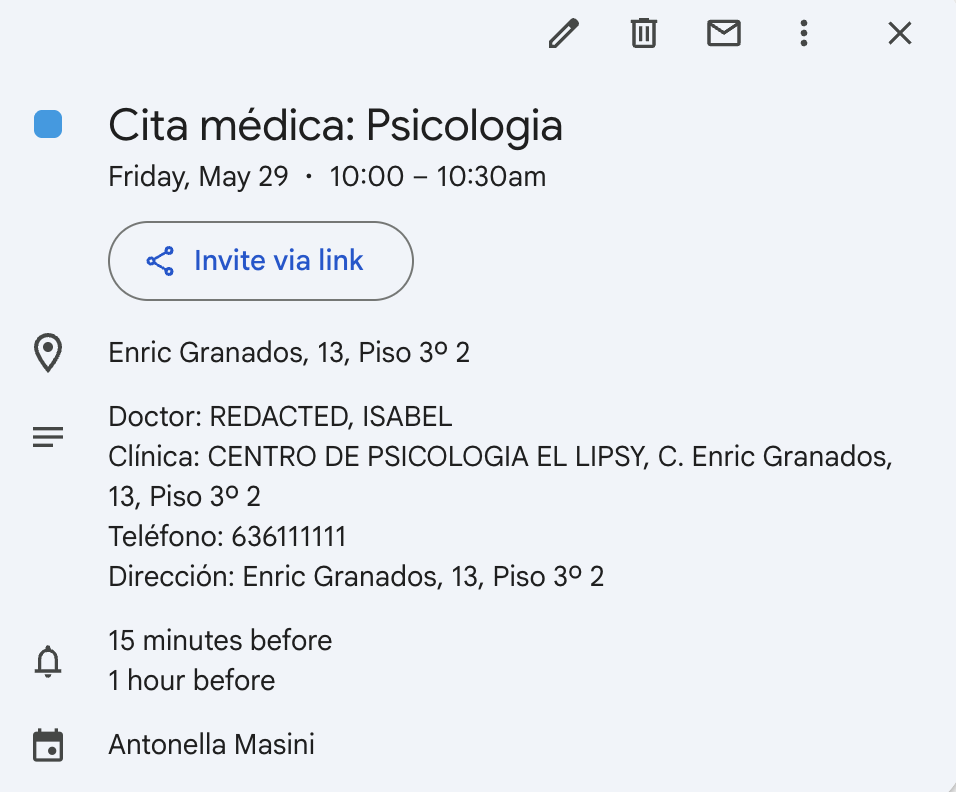

# MedAgent

**AI agent that books doctor appointments in Spain — so you don't have to.**

Private healthcare in Spain means calling clinic after clinic: no online booking, no centralized system, just phone tag. MedAgent handles the entire pipeline autonomously — from a single WhatsApp message to a confirmed appointment in your calendar.

## How It Works

```
WhatsApp message → Insurance scraper → Calendar check → Voice calls → Appointment booked
```

1. **You text WhatsApp** with what you need (e.g. "I need a psychologist")
2. **MedAgent asks your preference** — doctor gender (female/male/any)
3. **Logs into your insurance** (Cigna Spain) and finds covered doctors near you
4. **Checks your Google Calendar** for scheduling conflicts
5. **Calls each clinic** in natural Spanish using ElevenLabs Speech Engine
6. **Negotiates mid-call** — rejects conflicting slots, enforces gender preference, tries alternatives
7. **Confirms the booking** — adds it to your calendar and sends a WhatsApp confirmation

### Booking in Action

<p align="center">
  
</p>

> Request → OTP verification → gender preference → doctor found → appointment confirmed with doctor, address, and phone.

### Onboarding (One-Time Setup)

New users go through a quick WhatsApp onboarding before their first booking:

<p align="center">
  
  &nbsp;&nbsp;
  
</p>

> Name → address → insurer → time preference → secure credentials link → done.
> Insurance credentials are encrypted at rest and never logged.

## The Voice Call

The agent makes **real phone calls** to clinic receptionists, speaking natural Spanish. It handles the full negotiation:

- Introduces itself and states the reason for calling
- Mentions insurance coverage (Cigna) upfront
- Provides patient phone or insurance number when asked (spelled out digit by digit)
- Rejects time slots that conflict with your calendar
- Rejects wrong-gender doctors and asks specifically for the right one
- Confirms appointment details before hanging up

<p align="center">
  
</p>

> Real call negotiation: the agent rejects a conflicting slot (Wed 27 at 3:30pm), accepts Fri 29 at 10am, and confirms it's with a female psychologist.

### Google Calendar Integration

Confirmed appointments are automatically added to your Google Calendar:

<p align="center">
  
</p>

> The event includes doctor name, clinic address, phone number, and reminders.

## Architecture

```
                     ┌──────────────────────────────────────┐
                     │           ElevenLabs Servers          │
                     │   STT · TTS · Turn-taking · WebSocket │
                     └────────┬───────────────┬─────────────┘
                              │               │
                         audio│          transcript
                              │               │
┌─────────┐  call    ┌───────▼───────┐  ┌────▼────────────┐
│  Twilio  │◄────────│  /media-stream │  │   /ws endpoint  │
│ (phone)  │────────►│  audio bridge  │  │  Claude (LLM)   │
└─────────┘  audio   └───────────────┘  └─────────────────┘
                              │               │
                              └───────┬───────┘
                                      │
                              ┌───────▼───────┐
                              │   FastAPI      │
                              │   Server       │
                              ├───────────────┤
                              │ Cigna Scraper  │
                              │ Google Calendar│
                              │ WhatsApp Bot   │
                              │ Orchestrator   │
                              └───────────────┘
```

**ElevenLabs Speech Engine** handles the voice layer — STT, TTS, turn-taking, and interruption detection. Our server provides the LLM logic via Claude through the `/ws` WebSocket endpoint. **Twilio** places the actual phone call and bridges audio via `/media-stream`.

### Code Structure (Domain-Driven Design)

```
interfaces/  → application/  → domain/
                  ↑
            infrastructure/  (implements domain ports)
```

| Layer | What lives here |
|-------|----------------|
| `domain/` | Entities, value objects (`Specialty`, `Doctor`), repository interfaces. Pure Python. |
| `application/` | Use cases (`book_appointment`, `intent_parser`). Orchestrates via abstract ports. |
| `infrastructure/` | Cigna scraper, Twilio, ElevenLabs, Google Calendar, SQLite persistence. |
| `interfaces/` | FastAPI webhooks (WhatsApp, voice, Speech Engine `/ws`). |

## Tech Stack

| Component | Technology |
|-----------|-----------|
| Voice (STT/TTS/turn-taking) | [ElevenLabs Speech Engine](https://elevenlabs.io/docs/eleven-api/guides/how-to/speech-engine/python-sdk-reference) |
| LLM (conversation brain) | Claude (Anthropic) |
| Phone calls | Twilio Programmable Voice |
| Messaging | Twilio WhatsApp Sandbox |
| Insurance scraper | Playwright + Cigna Spain API |
| Calendar | Google Calendar API (OAuth2) |
| Backend | FastAPI + SQLite + Alembic |
| Package manager | uv |

## Setup

### Prerequisites

- Python 3.11+
- [uv](https://docs.astral.sh/uv/) package manager
- Twilio account (with WhatsApp sandbox + voice number)
- ElevenLabs API key
- Anthropic API key
- Google Cloud project (for Calendar OAuth2)
- ngrok (for local development)

### Install

```bash
# Install dependencies + Playwright browser
make install

# Configure environment
cp .env.example .env
# Generate encryption key:
python -c "from cryptography.fernet import Fernet; print(Fernet.generate_key().decode())"
# Fill in all API keys in .env
```

### Set Up ElevenLabs Speech Engine

```bash
# Creates the Speech Engine agent + registers your Twilio number
uv run python scripts/setup_speech_engine.py --ws-url wss://YOUR-NGROK-URL.ngrok-free.dev/ws
# Copy the printed ELEVENLABS_AGENT_ID and ELEVENLABS_PHONE_NUMBER_ID to .env
```

### Set Up Google Calendar

1. Create OAuth 2.0 credentials at [Google Cloud Console](https://console.cloud.google.com/apis/credentials)
2. Enable the Google Calendar API
3. Add redirect URI: `<your-BASE_URL>/auth/google/callback`
4. Fill `GOOGLE_CALENDAR_CLIENT_ID` and `GOOGLE_CALENDAR_CLIENT_SECRET` in `.env`
5. After starting the server, authorize via WhatsApp (the bot sends an auth link on first use)

## Running Locally

```bash
make run
```

This starts ngrok, writes the tunnel URL into `.env` as `BASE_URL`, and starts uvicorn with `--reload`. The only manual step is **pasting the printed URL into Twilio's WhatsApp sandbox webhook field**.

```bash
make stop     # Kill leftover processes
make logs     # Tail ngrok logs
```

Manual alternative:

```bash
uv run uvicorn main:app --reload   # terminal 1
ngrok http 8000                    # terminal 2 — update BASE_URL in .env
```

### Demo Mode

To test against your own phone instead of real clinics:

```bash
# In .env:
DEMO_MODE=true
DEMO_RECEPTIONIST_NUMBER=+34612345678   # Your phone number
```

## Database

SQLite for development. Alembic manages migrations. The FastAPI lifespan runs `alembic upgrade head` on boot.

```bash
uv run alembic upgrade head                              # Apply pending
uv run alembic revision --autogenerate -m "description"  # Generate migration
uv run alembic downgrade -1                              # Roll back
```

## Testing

```bash
uv run pytest -q          # Run all tests
uv run ruff check .       # Lint
```

## Supported Insurers

| Insurer | Status |
|---------|--------|
| Cigna Spain | Fully supported |
| Adeslas | Planned (#8) |

The scraper architecture uses **browser for auth, API for actions** — Playwright handles the login flow (NIE/NIF + password + SMS OTP via Okta), then all data fetches go through Cigna's internal JSON API. See `CLAUDE.md` for the full endpoint chain.

## License

Open source. See [LICENSE](LICENSE) for details.

---

*Built for [ElevenHacks](https://elevenlabs.io/hackathon) 2026. One WhatsApp message. Fully autonomous booking.*
